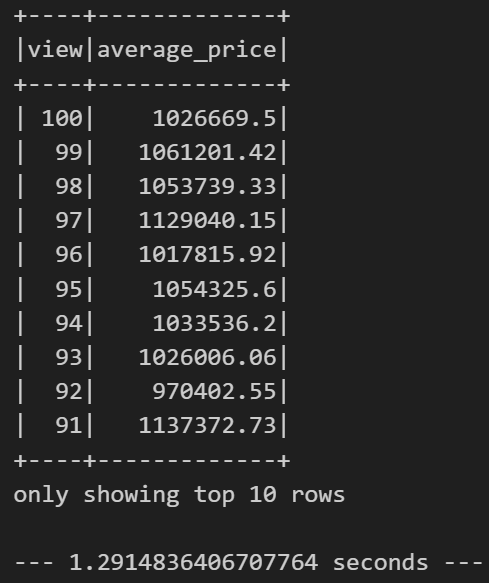

# Home_Sales
This challenge is to determine key metrics about home sales data using PySpark. 
I have created temporary views, partitioned the data, cached and uncached a temporary table, and verified that the table has been uncached.

## Process followed:

1. Imported the necessary PySpark SQL functions required for this assignment.

2. Read the home_sales_revised.csv data in the starter code into a Spark DataFrame.

3. Created a temporary table called home_sales.

4. Have done some Exploratory Data Analysis using SQL queries in PySpark.

5. Cached the temporary table home_sales and verified if the table is cached.

6. Using the cached data, ran the last query that calculates the average price of a home per "view" rating having an average home price greater than or equal to $350,000 and determined the runtime and compared it to uncached runtime.

**Observation** It is observed that the runtime for the cached data is 1.02 seconds which is less compared to the uncached data.

7. Partitioned by the "date_built" field on the formatted parquet home sales data.

8. Created a temporary table for the parquet data and ran the query that calculates the average price of a home per "view" rating having an average home price greater than or equal to $350,000 again and determine the runtime and compared it to uncached runtime.

**Observation:** It is observed that the runtime for Parquet data is 2.5 seconds and for uncached data, the runtime is 1.29 seconds. So, the runtime of parquet data is more than uncached data.

9. Uncached and verified the home_sales temporary table.

## Questions answered: 

1. Average price for a four-bedroom house sold for each year. 

2. Average price of a home for each year the home was built, that has three bedrooms and three bathrooms.

3. Average price of a home for each year the home was built, that has three bedrooms, three bathrooms, two floors, and is greater than or equal to 2,000 square feet.

4. Average price of a home per "view" rating having an average home price greater than or equal to $350,000 and the run time for this query.

